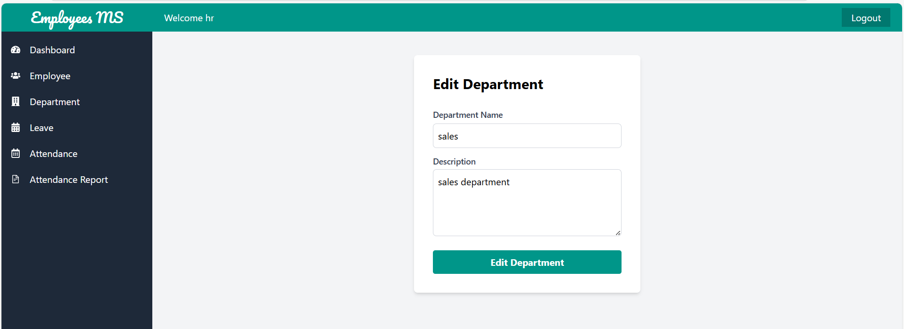
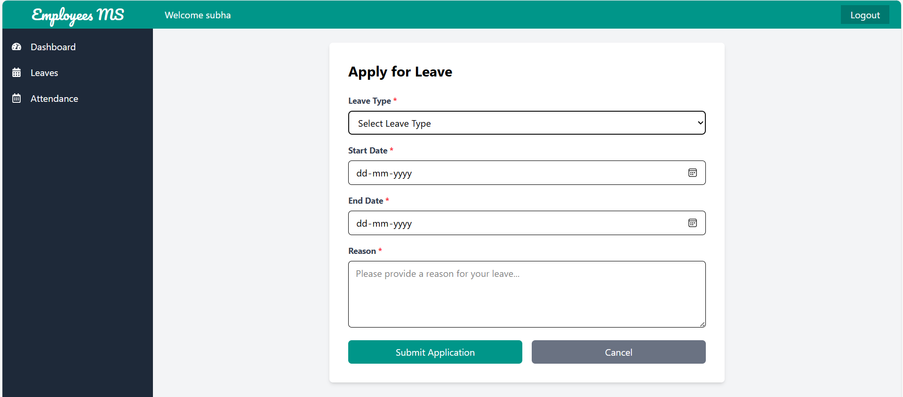

<h1 align="center">🧑‍💼 Employee Management System</h1>

<p align="center">
  
  
  
</p>

---

## 🧩 About the Project

The **Employee Management System (EMS)** is a web application that helps organizations manage their workforce efficiently.  
It enables users to **create, store, and manage employee records**, while providing separate dashboards for **Admin**, **HR**, and **Employees**, each with unique access privileges and authentication.

> “A simple yet powerful way to manage your company’s workforce digitally.”

---

## 🌈 Features

✅ Role-based authentication (Admin, HR, Employee)  
✅ Secure login and JWT authorization  
✅ Manage employees, departments, and branches  
✅ MongoDB-powered backend  
✅ Responsive and user-friendly interface  
✅ Built with the MERN stack (MongoDB, Express, React, Node.js)

---

## 🧠 Tech Stack

| Technology | Description |
|-------------|-------------|
| ⚛️ **React.js** | Frontend framework for UI components |
| 🌐 **Node.js** | JavaScript runtime for backend |
| 🚀 **Express.js** | Server-side framework |
| 🧱 **MongoDB** | NoSQL database for employee records |
| 🔒 **JWT / bcrypt.js** | Authentication and password security |
| 🎨 **Tailwind CSS** | For responsive design and modern UI |

---
## 📂 Project Structure

```
employee-management-system/
│
├── backend/
│   ├── server.js
│   ├── routes/
│   ├── models/
│   ├── controllers/
│   └── config/
│
├── frontend/
│   ├── src/
│   │   ├── components/
│   │   ├── pages/
│   │   ├── App.jsx
│   │   ├── index.jsx
│   │   └── styles/
│
├── screenshots/
│   ├── login-page.png
│   ├── admin-home.png
│   ├── admin-dashboard.png
│   ├── hr-dashboard.png
│   └── employee-dashboard.png
│
└── README.md
```

---

## ⚙️ Installation and Setup

```bash
# 1️⃣ Clone the repository
git clone https://github.com/your-username/employee-management-system.git
cd employee-management-system

# 2️⃣ Install backend dependencies
cd backend
npm install

# 3️⃣ Install frontend dependencies
cd ../frontend
npm install
```


### ▶️ Run the Application

```bash
# Run backend
cd backend
npm start

# Run frontend
cd ../frontend
npm run dev
```

The app will be available at:  
👉 **Frontend:** http://localhost:5173  
👉 **Backend API:** http://localhost:5000  

---

## 🔒 Authentication and Authorization

| Role | Privileges |
|------|-------------|
| **Admin** | Full access — manage HR and Employee accounts |
| **HR** | Manage employees under their department |
| **Employee** | View and update personal details |

---

## 🖥️ Dashboards Overview

| Role / Section | Description | Screenshot |
|----------------|-------------|------------|
| **Admin Dashboard** | Overview of company and employee statistics |  |
| **Employee (Admin)** | Manage employee records |  |
| **Employee (Admin)** | Admin can ReEdit Employee Details (add, edit, delete) |  |
| **Department (Admin)** | Manage company departments |  |
| **Leave (Admin)** | Approve or reject leave requests |  |
| **Attendance Report (Admin)** | View and export attendance reports |  |
| **Department (HR)** | View department details |  |
| **Attendance (HR)** | Monitor team attendance Approved or Reject |  |
| **Leave (Employee)** | Apply for leave and view leave status |  |
| **Leave (Employee)** | Apply for leave and choose leave Types |  |
| **Attendance (Employee)** | View personal attendance records |  |


---

## 📱 Mobile-Friendly UI

Built with **Tailwind CSS**, the application is optimized for all screen sizes — ensuring a smooth experience on desktops, tablets, and smartphones.

---

## 🧾 Future Enhancements

- ✅ Attendance and payroll management  
- ✅ Email notifications  
- ✅ Performance tracking system  
- ✅ Data analytics and reporting  

---

## 🙋‍♀️ About Me

**Subhasmita Sahoo**  
FullStack Developer | MERN Stack Developer  

📍 *Khordha, Odisha, India*  
📧 [subhasmita4602@gmail.com](mailto:subhasmita4602@gmail.com)  
💼 [LinkedIn](https://www.linkedin.com/in/subhasmita-sahoo-puja) | 🌐 [GitHub](https://github.com/subhasmita-puja) | 🙋‍♀️ [Personal Portfolio](portfolio-iota-topaz-92.vercel.app/)

---

## 🌟 Show Your Support

If you like this project, please **⭐ star** this repository and share your feedback!

---

## 📜 License

This project is licensed under the **MIT License** — free to use and modify.
